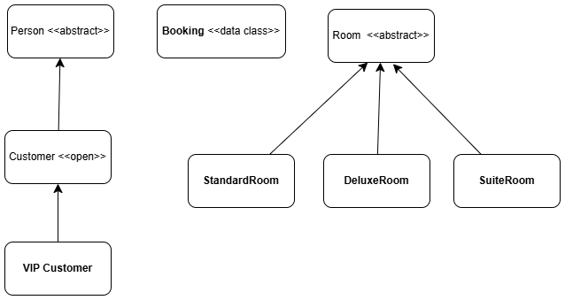

# 🏨 Hotel Booking Management System

## 📌 Giới thiệu

****Hotel Booking Management System** là một ứng dụng console viết bằng **Kotlin**, mô phỏng quy trình đặt phòng khách sạn từ đầu đến cuối.  
 thể hiện rõ các nguyên lý **Lập trình Hướng Đối Tượng (OOP)** 

---

## ✨ Chức năng chính

### 🔹 1. Quản lý phòng (Room Management)
- Xem danh sách phòng
- Thêm, cập nhật, xóa phòng
- Tìm kiếm và lọc:
  - Theo loại phòng: `STANDARD`, `DELUXE`, `SUITE`
  - Theo khoảng giá
  - Theo trạng thái (chỉ hiện phòng trống)

### 🔹 2. Đặt phòng (Booking Management)
- Tạo booking mới cho khách hàng
- Tính **tổng tiền tự động** dựa trên số đêm và loại phòng
- Khách VIP tự động được giảm giá
- Chọn phương thức thanh toán (`CASH`, `CREDIT_CARD`)
- Xác nhận / Hủy booking (cập nhật trạng thái phòng tự động)

### 🔹 3. Quản lý khách hàng (Customer Management)
- Đăng ký khách hàng mới (Basic / Premium / VIP)
- Cập nhật thông tin khách hàng
- Xóa khách hàng
- Hiển thị danh sách tất cả khách hàng

### 🔹 4. Thanh toán & Hóa đơn (Payment Management)
- Thực hiện thanh toán (bất đồng bộ bằng **Coroutine**)
- Xuất hóa đơn kèm thông tin chi tiết
- Xem danh sách tất cả thanh toán và hóa đơn

### 🔹 5. Báo cáo (Report Management)
- Báo cáo doanh thu (Revenue Report)
- Báo cáo trạng thái phòng
- Báo cáo danh sách khách hàng

---

## 🧩 Các khái niệm OOP áp dụng

| Khái niệm | Mô tả |
|------------|--------|
| **Abstraction** | `Person`, `Room` là lớp trừu tượng. |
| **Inheritance** | `Customer` → `VIPCustomer`, `Room` → `DeluxeRoom`, `SuiteRoom`, `StandardRoom`. |
| **Polymorphism** | Sử dụng interface `Discountable` và ghi đè `discountRate()` trong lớp con. |
| **Encapsulation** | Các thuộc tính được bảo vệ bằng `private` và truy cập thông qua getter/setter. |
| **Interface** | `Discountable` định nghĩa cơ chế giảm giá cho khách hàng. |

---

## 🏗️ Kiến trúc hệ thống

## 📂 Cấu trúc thư mục dự án

```plaintext
summarytask12/
│
├── controller/          # Xử lý logic giao diện console (menu, nhập/xuất)
├── model/               # Khai báo đối tượng dữ liệu (Room, Booking, Customer, Payment...)
│   ├── accommodation/   # Các loại phòng: Standard, Deluxe, Suite
│   ├── payment/         # Thanh toán & Hóa đơn
│   └── users/           # Người dùng: Customer, VIPCustomer
│
├── repository/          # Quản lý dữ liệu trong bộ nhớ (in-memory database)
├── services/            # Xử lý nghiệp vụ, tương tác giữa controller và repository
├── extensions/          # Các hàm mở rộng (filter, sort, summary, v.v.)
├── utils/               # Hằng số, enum, message, input/output handler
└── Main.kt              # Điểm khởi chạy chương trình

```

## 📊 Sơ đồ phân cấp hệ thống

<p align="center">
  
</p>
